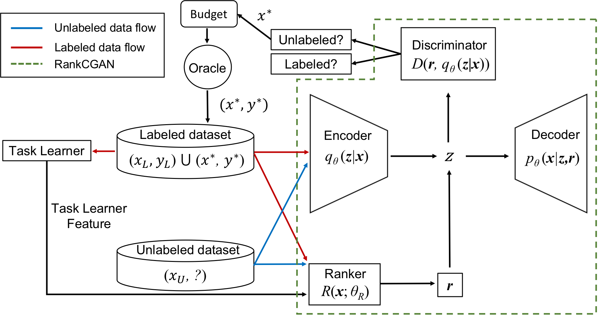

# __Task-Aware Variational Adversarial Active Learning__ - _Official Pytorch implementation of the CVPR 2021 paper_

__*Kwanyoung Kim, Dongwon Park, Kwang In Kim, Se Young Chun*__

Official Pytorch implementation for [the paper](https://arxiv.org/pdf/2002.04709.pdf) presented on CVPR 2021 titled "_Task-Aware Variational Adversarial Active Learning_".


</img>

# Abstract
_We propose task-aware variational adversarial AL (TA-VAAL) that modifies task-agnostic VAAL, that considered data distribution of both label and
unlabeled pools, by relaxing task learning loss prediction to ranking loss prediction and by using ranking conditional
generative adversarial network to embed normalized ranking loss information on VAAL. Our proposed TA-VAAL outperforms state-of-the-arts on various benchmark datasets for
classifications with balanced / imbalanced labels as well as semantic segmentation and its task-aware and task-agnostic AL properties were confirmed with our in-depth analyses._
## Prerequisites:   
- Linux or macOS
- Python 3.5/3.6
- CPU compatible but NVIDIA GPU + CUDA CuDNN is highly recommended.
- pytorch 0.4.1
- cuda 8.0
- Anaconda3

## Requirements

To install virtual enviornment for requirements:

```setup
conda env create -f TAVAAL.yaml
```

> 📋if you already conda, you can activate virtual experiment settings

To activate virtual enviornment:

```activate
conda activate TAVAAL
```

## Running code

To train the model(s) and evaluate in the paper, run this command:

```train
python main.py -m TA-VAAL -d cifar10 -c 5 # Other available datasets cifar100, fashionmnist, svhn
```

if you want to experiment about cifar_imbal. you can run this command:

```
python main.py  -d cifar10 cifar10im
```
